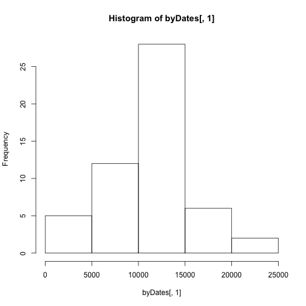
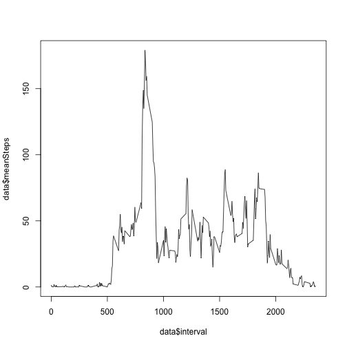
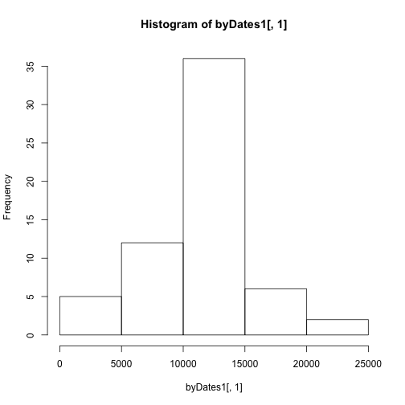
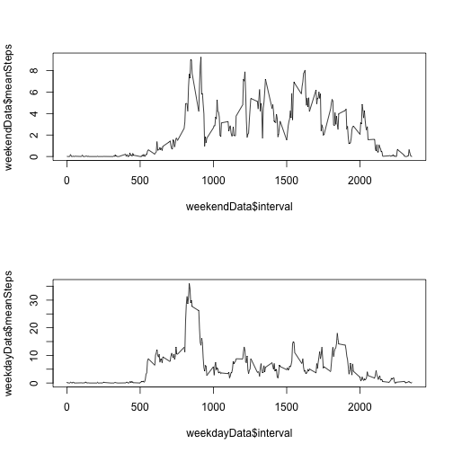

# Reproducable Research: Peer Assessment 1
This paper will make some general interpretation of activity data collected from monitoring devixes such as Fitbit, Nike Fuelbank or Jawbone Up. We make use of the best practices in reproducable research such that anyone is capable of reproducing the results. 

## Loading and preprocessing the data
The first step in our analyis is to load the data. The data contains a date field which we will later use for manipulations. Because of this, we must explicitly declare the date column as a date field in R. 

```r
testData = read.csv("/Users/udumami/Dropbox/coursera/Reproducable Research/RepData_PeerAssessment1/activity.csv")
testData$date = as.Date(testData$date)
```

## What is mean total number of steps taken per day?
Next, we will report on the mean number of steps per day. We will also make a histogram of the total number of steps taken each day. 

```r
byDates = rowsum(testData$steps, format(testData$date, "%Y-%m-%d"))
hist(byDates[,1])
```

 

```r
mean(byDates[,1], na.rm=TRUE)
```

```
## [1] 10766.19
```

```r
median(byDates[,1], na.rm=TRUE)
```

```
## [1] 10765
```

## What is the average daily activity pattern?
Activity data happens in real time and it useful to view the data as a time series. Below is a time series line chart on 5 minute interval showing the averave number of steps. You can see that the maximum 5 minute interval is 835. 

```r
data = aggregate(testData$steps, by=list(interval=testData$interval), FUN=sum, na.rm=TRUE)
data$meanSteps = data$x/nrow(byDates)
plot(data$interval, data$meanSteps, type="l")
```

 

## Imputing missing values
A simple analysis of the data set shows many missing values (see below for count). We will use a simple strategy of using the mean number of steps for any missing data. With the missing values populated, we will rurun our histogram along with mean and median calculations. 

```r
sum(is.na(testData$steps))
```

```
## [1] 2304
```

```r
library(plyr)
impute.mean <- function(x) replace(x, is.na(x), mean(x, na.rm = TRUE))
newData = ddply(testData, ~ interval, transform, steps=impute.mean(steps))
byDates1 = rowsum(newData, format(newData$date, "%Y-%m-%d"))
hist(byDates1[,1])
```

 

```r
mean(byDates1[,1], na.rm=TRUE)
```

```
## [1] 10766.19
```

```r
median(byDates1[,1], na.rm=TRUE)
```

```
## [1] 10766.19
```

## Are there differences in activity patterns between weekdays and weekends?
Finally, you can assume that the behavior of an invidual will differ on the weekday and weekend. Below is a time series plot showing the mean steps per 5 minute interval by weekend and weekday. 

```r
newData$dayType = ifelse (weekdays(newData$date) %in% list("Saturday", "Sunday") , "Weekend", "Weekday")
data = aggregate(newData$steps, by=list(interval=newData$interval, dayType=newData$dayType), FUN=sum, na.rm=TRUE)
weekendData = subset(data, dayType=="Weekend")
weekdayData = subset(data, dayType=="Weekday")

weekendData$meanSteps = weekendData$x/nrow(weekendData)
weekdayData$meanSteps = weekdayData$x/nrow(weekdayData)

par(mfrow=c(2, 1))
plot(weekendData$interval, weekendData$meanSteps, type="l")
plot(weekdayData$interval, weekdayData$meanSteps, type="l")
```

 
